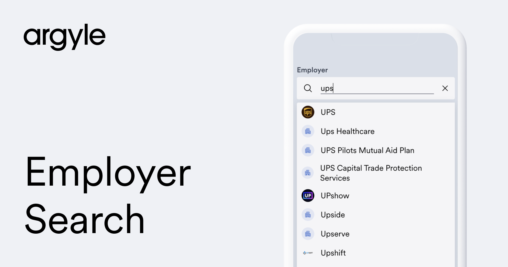

## Employer Search



Employer Search is a pre-built custom search bar you can copy and insert into your applications.

- Applicants are suggested employers and payroll providers covered by Argyle based on their free-text search inputs, and then directly connected to their selection's respective login screen in Link to establish a payroll connection.
- The standardized name of their chosen employer or payroll provider, and the payroll data retrieved from the connection, can be used to autofill and streamline the remainder of their application.

[Demo](https://sampleapps.argyle.com/employer-search) the sample app in your browser today, visit our [Employer Search Documentation](https://argyle.com/docs/overview/employer-search) for more information, or get started with your implementation using the steps below.

## Getting Started

1. Rename `env.example` to `.env` and fill in Argyle related keys from your https://console.argyle.com account.

2. Install the dependencies

```bash
npm install
# or
yarn install
```

3. Run the development server:

```bash
npm run dev
# or
yarn dev
```

4. Open [http://localhost:3000](http://localhost:3000) with your browser to see the result.

## Tech stack

This is a [Next.js](https://nextjs.org/) project bootstrapped with [`create-next-app`](https://github.com/vercel/next.js/tree/canary/packages/create-next-app). It uses [Tailwind CSS](https://tailwindcss.com/) for styling. [Downshift](https://github.com/downshift-js/downshift) provides primitives for autocomplete component, while [Fuse.js](https://fusejs.io/) is used for fuzzy-matching.

## Prerequisites

- [Argyle Console Account](https://console.argyle.com/sign-up)

## Learn More

To learn more, take a look at the following resources:

- [Next.js Documentation](https://nextjs.org/docs) - learn about Next.js features and its API.
- [Argyle Docs](https://argyle.com/docs) - learn about implementing Argyle.
